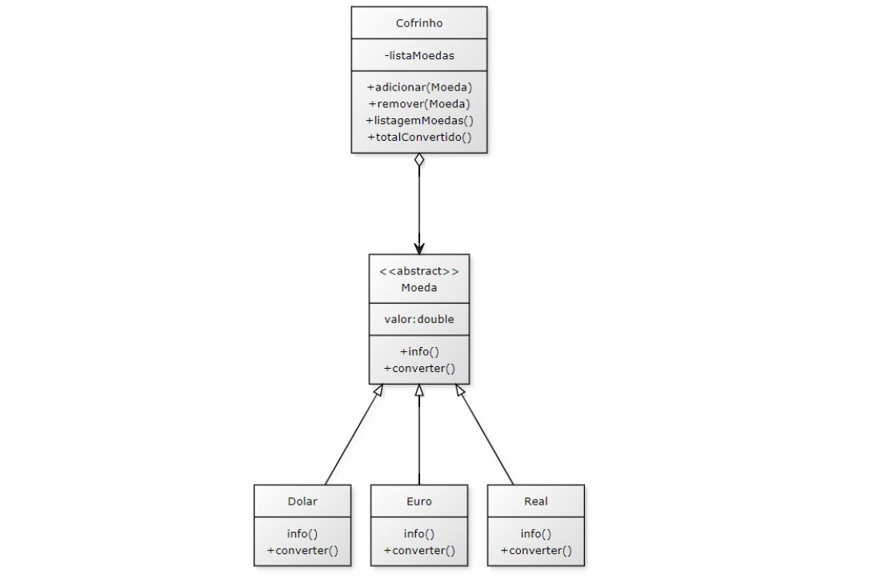

# Enunciado da Atividade Prática

> Disciplina: Programação Orientada a Objetos — UNINTER  
> Curso: Análise e Desenvolvimento de Sistemas · 2025

---

## Objetivo

Implementar um pequeno sistema que emula um **Cofrinho de Moedas** em Java, com menu interativo oferecendo as seguintes operações ao usuário:

- Adicionar moedas de diferentes valores e países ao cofrinho
- Remover moedas específicas do cofrinho
- Listar todas as moedas presentes no cofrinho
- Calcular o total do cofrinho convertido para Real

O objetivo principal é avaliar o bom uso dos conceitos de **herança** e **polimorfismo**.

---

## Requisitos de implementação

- O projeto deve possuir uma classe `Principal` além das classes descritas no diagrama UML
- A classe `Cofrinho` deve possuir como atributo uma **coleção de Moedas**
- `Moeda` é uma **classe abstrata** — classe mãe de `Dolar`, `Euro`, `Real`, etc.
- A coleção pode ser implementada com `ArrayList` ou outra estrutura de dados pertinente
- Demais detalhes de implementação ficam a cargo do aluno
- É permitido criar classes extras ou adicionar métodos e atributos conforme necessário

---

## Diagrama UML fornecido

O diagrama define a estrutura base do sistema:

| Classe | Tipo | Papel |
|--------|------|-------|
| `Cofrinho` | Concreta | Gerencia a coleção de moedas via agregação |
| `Moeda` | Abstrata | Define o contrato com `info()` e `converter()` |
| `Real` | Concreta | Implementa `Moeda` para a moeda brasileira |
| `Dolar` | Concreta | Implementa `Moeda` para o dólar americano |
| `Euro` | Concreta | Implementa `Moeda` para o euro europeu |

---

## Critérios de avaliação

O trabalho foi avaliado com foco em:

- Uso correto de **herança** — subclasses especializando a classe abstrata `Moeda`
- Uso correto de **polimorfismo** — método `converter()` com comportamento diferente em cada subclasse
- Organização e clareza do código
- Funcionamento correto do menu e das operações
